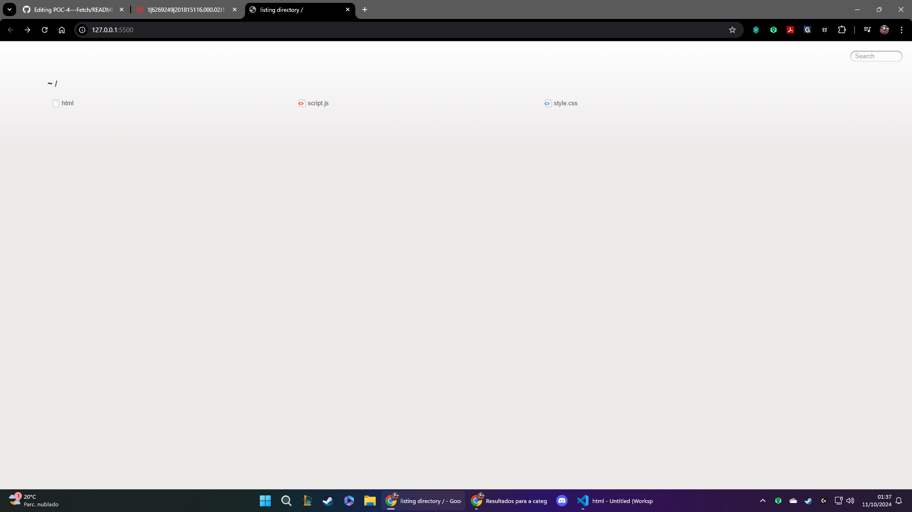

# POC-4---Fetch

## Alunos:
* Caio Sampaio. RA: 10381053;
* Guilherme Picoli. RA: 10389843;
* Caio Filardi. RA: 10341128;

## Enunciado:
Criar uma POC que mostre o funcionamento do método assíncrono fetch, no javascript.
Para isso, consulte o material de aula:
* https://bragafilho.craft.me/async
Busque uma API que seja simples o suficiente para a POC. Como sugestão de APIs, acesse:
* https://github.com/public-apis/public-apis
Exemplo de POC:
* https://github.com/phcacique/webmobile2024/tree/main/poc4_api

## Chamadas assíncrona
Chamadas assíncronas em JavaScript permitem que operações sejam executadas de forma concorrente, sem bloquear o fluxo principal da aplicação. Isso é particularmente útil em situações onde uma operação pode demorar para ser
concluída, como operações de I/O (entrada/saída), requisições de rede, ou consultas de banco de dados. Em vez de esperar que a operação seja concluída antes de continuar, JavaScript permite que o restante do código seja
executado enquanto a operação assíncrona está em andamento.

#### Vantagens do código assíncrono:
Performance melhorada: O código assíncrono permite que outras operações sejam realizadas enquanto o código aguarda por uma resposta, o que melhora o desempenho, especialmente em aplicações web.
UX aprimorada: Não travar a interface do usuário durante operações demoradas, proporcionando uma experiência mais fluida.
#### Desafios do código assíncrono:
Gerenciamento de Erros: O código assíncrono pode ser difícil de debugar e tratar erros. Embora Promises e async/await facilitem, o controle de fluxos complexos com várias chamadas assíncronas pode ser complicado.

### Promise: 
O conceito de Promises (promessas) é uma das principais formas de lidar com operações assíncronas. Uma promise representa um valor que pode estar disponível agora, no futuro, ou nunca. Uma promessa pode estar em três estados:
* Pending (Pendente): A operação ainda não foi concluída.
* Fulfilled (Concluída): A operação foi concluída com sucesso e o resultado está disponível.
* Rejected (Rejeitada): Ocorreu um erro durante a operação.

```javascript
let promessa = new Promise((resolve, reject) => {
    let sucesso = true;

    if (sucesso) {
        resolve("A operação foi bem-sucedida.");
    } else {
        reject("Ocorreu um erro.");
    }
});

promessa
    .then((resultado) => console.log(resultado))  // Caso a operação tenha sucesso
    .catch((erro) => console.log(erro));          // Caso ocorra um erro
```

### Async/Await:
A partir do ECMAScript 2017 (ES8), foi introduzida uma forma ainda mais fácil e legível de lidar com código assíncrono através do uso das palavras-chave async e await. Elas permitem que você escreva código assíncrono de forma que pareça síncrono, sem a necessidade de encadear múltiplos .then().

* Async: Marca uma função como assíncrona e faz com que ela sempre retorne uma Promise.
* Await: Pausa a execução da função assíncrona até que a Promise seja resolvida ou rejeitada.
Exemplo usando async e await:

```javascript
async function exemploAssincrono() {
    try {
        let resultado = await promessa;  // Espera a promessa ser resolvida
        console.log(resultado);
    } catch (erro) {
        console.log(erro);  // Trata o erro se a promessa for rejeitada
    }
}
exemploAssincrono();
```

### Fetch
O método fetch() do JavaScript é uma API nativa que facilita o envio de requisições HTTP (como GET, POST, PUT, DELETE) para servidores e a obtenção de respostas de forma assíncrona. Ele substitui o antigo XMLHttpRequest e oferece uma maneira mais simples e moderna de realizar chamadas de rede.
#### Como o fetch() funciona?
O método fetch() retorna uma Promise, que será resolvida quando a resposta do servidor estiver disponível. Se a requisição for bem-sucedida, a Promise será resolvida com um objeto Response, que contém os dados retornados pela requisição. Caso haja um erro, a Promise será rejeitada.

## Usando o método fecth + APi Random User
#### API Random User
A Random User API é uma API gratuita que fornece dados aleatórios sobre usuários fictícios. Ela é amplamente utilizada em projetos de desenvolvimento para testar funcionalidades que envolvem a exibição de informações de perfil de usuários, como nome, foto, email, localização, entre outros dados comuns.
Essa API é útil para criar cenários realistas, simulando o uso de dados de usuários sem a necessidade de ter uma base de dados real. Como os dados são gerados dinamicamente, você sempre obtém novos perfis ao fazer chamadas à API.

Como Funciona:
* HTML: Um botão para carregar os usuários e uma área para exibir os resultados.
* CSS: Estilos simples para deixar os cartões de usuário mais organizados.
* JavaScript: A função loadUsers usa fetch para obter dados da API https://randomuser.me.
Quando o botão é clicado, os dados dos usuários são carregados e exibidos na página.



* Tela Inicial do site


* Tela onde o botão para acionarmos a API está presente, ao clicar os dados randomicos de usuários serão carregados na página


* Tela após os dados serem carregados
